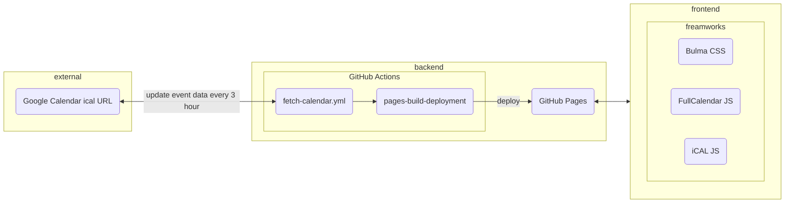

# Rover Calendar
ローバー向けのイベントを集約するカレンダー
## 使い方
[使い方](https://hackmd.io/@msy14/rover-calendar)
## ドキュメント
[ドキュメント](https://hackmd.io/@msy14/rover-calendar/%2Fg_lZKPjpSKSJVyY_ANF_Fw)
## スクリーンショット 🖼️

## 実装イメージ

## ライセンス
[MIT License](https://github.com/fox-Nh133/rover-calendar/blob/main/LICENSE.md)
